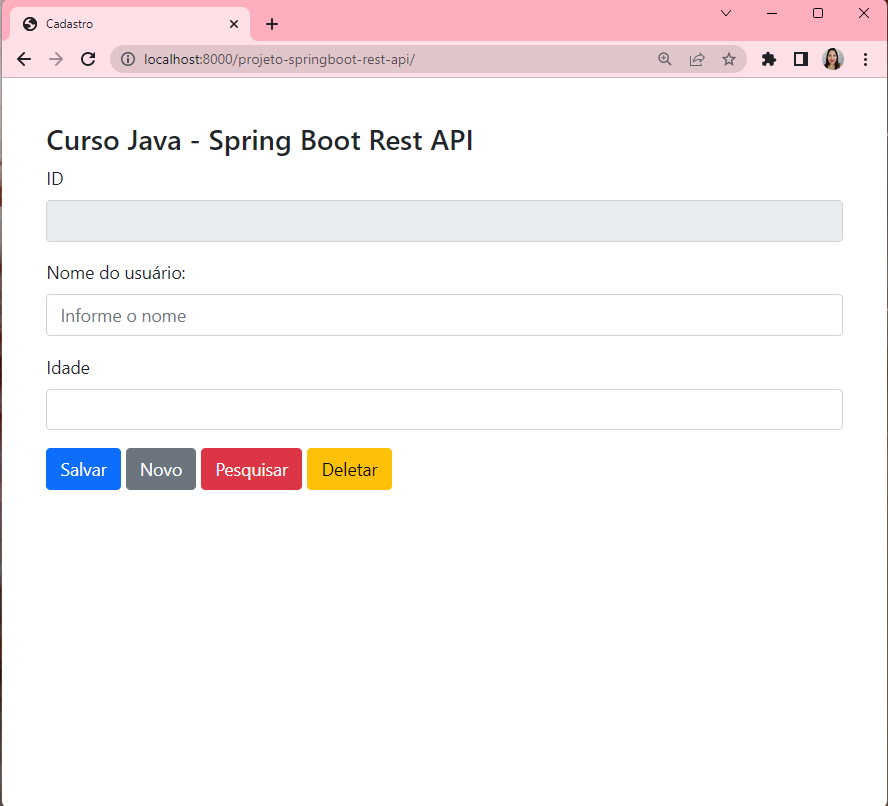
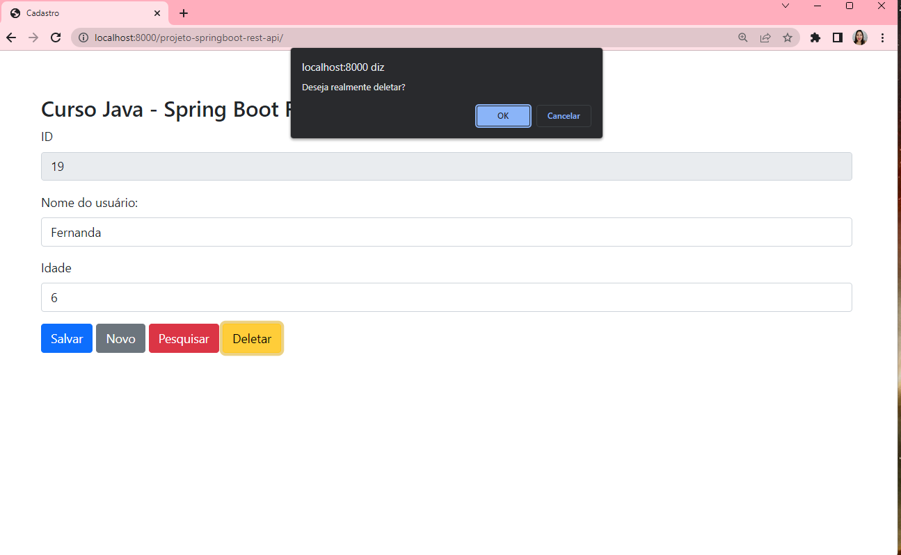
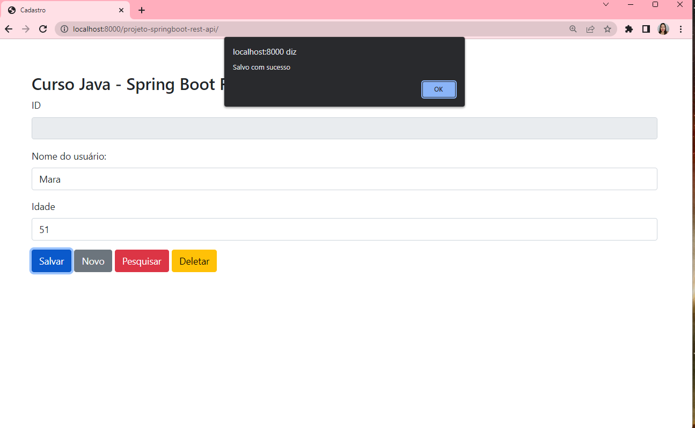
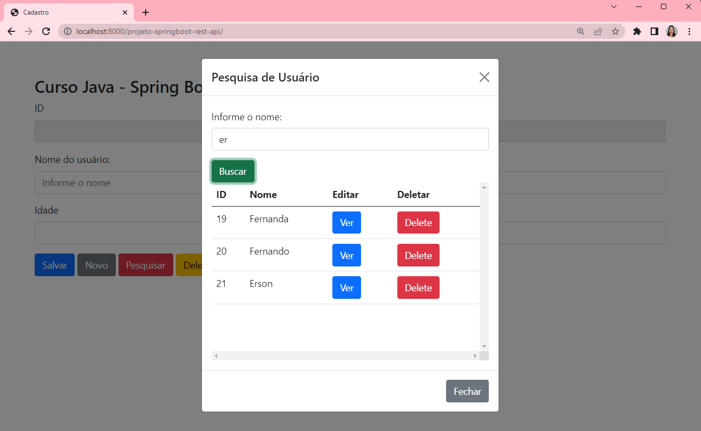

# Projeto Spring Boot Rest API

  <a href="#-tecnologias">Tecnologias</a>&nbsp;&nbsp;&nbsp;|&nbsp;&nbsp;&nbsp;  
  <a href="#-projeto">Projeto</a>&nbsp;&nbsp;&nbsp;|&nbsp;&nbsp;&nbsp;  
  <a href="#-imagem">Imagens</a>&nbsp;&nbsp;&nbsp;|&nbsp;&nbsp;&nbsp; 
  <a href="#-gif">Gif</a>&nbsp;&nbsp;&nbsp;&nbsp;&nbsp;&nbsp;

 

## 🚀 Tecnologias

Esse projeto foi desenvolvido com as seguintes tecnologias:
- Java
- Spring Boot
- Maven
- HTML
- Bootstrap
- Jquery
- Ajax
- Postman
- PostgreSQL
- Git e Github

 

## 💻 Projeto

Projeto de CRUD completo desenvolvido em Java.
- Criação do projeto Spring Boot Rest API com Maven
- Criação do model e tabela no banco
- Criação do Repository com Spring Data
- Criação de END-POINT para listar todos usuários, salvar no banco, DELETE do banco, buscar e atualizar no banco e consultar por parte do nome
- Utilização do Postman para teste de API REST
- Instalação do MAVEN para gerar o JAR de Implantação no servidor
- Geração do JAR do Spring Boot com Maven
- Criação da página inicial com Bootstrap
- Instalação do JQuery no projeto
- Salvando com AJAX enviando para API REST no END-POINT salvar
- Criação de uma tela MODAL para pesquisar e editar com END-POINT
- Criação da rotina de DELETE com END-POINT

 

## 📸 Imagens

Pagina de Cadastro

</img>

Pagina Deletar

</img>

Pagina de Salvar

</img>

Pagina de Pesquisar

</img>

## 📸 Gif

Pagina do Alura Space

</img>

## 📁 Acesso ao projeto

[Veja o projeto final do curso em funcionamento](https://github.com/Thamyresmya/Projeto_Spring_Boot_Rest_API).

 

- Me siga nas redes sociais:
- [Linkedin](https://www.linkedin.com/in/thamyrescavalcante/)
- [Instagran](https://www.instagram.com/thamyres__cavalcante/)

 

---

Feito com ♥ by Thamyres Cavalcante.

